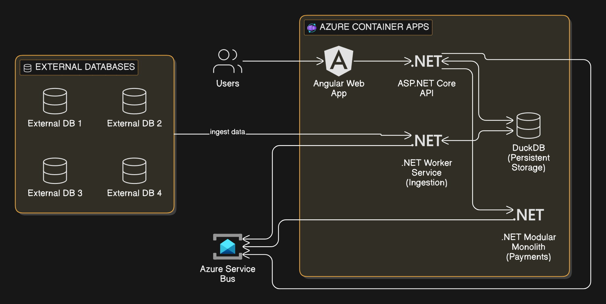

# Municipio PoC — Ingestión con Backpressure & Multi-Agent Orchestration 🚀

Este repositorio contiene una Prueba de Concepto (PoC) avanzada de arquitectura distribuida diseñada con **.NET Aspire**, orientada a escenarios de alta disponibilidad, ingesta masiva de datos con control de flujo y desarrollo autónomo guiado por agentes de IA.

---

## 🏗️ Aspectos Clave de la Arquitectura

* **Orquestación con .NET Aspire:** Gestión unificada de los servicios distribuidos (`api` e `ingestion`).
* **Control de Backpressure Nativo:** Uso de `System.Threading.Channels` para limitar y mitigar el consumo de memoria RAM (Límite estricto a 4.0 GB) durante picos de carga.
* **Motor OLAP Embebido:** Integración con **DuckDB** para lecturas analíticas y agregaciones ultrarrápidas desde la capa del Frontend.
* **Native AOT Ready:** Backend preparado para compilación *Ahead-Of-Time*, optimizando drásticamente los tiempos de arranque en frío y el uso de memoria.
* **Frontend Angular:** Panel de control en tiempo real para monitorear las métricas de ingesta y estados del backpressure.

---

## 🤖 Fábrica de Software Autónoma (`/.agents`)

La evolución de la base de código está pensada para ser asistida por un equipo de agentes autónomos basados en roles, cada uno especializado mediante contextos y guías de habilidades (`skills/`):

* 📝 **Analista:** Refinamiento de requerimientos funcionales.
* 📐 **Arquitecto .NET:** Validación de patrones y estándares técnicos.
* 💻 **Fullstack Agent:** Generación de componentes estructurados en .NET y Angular.
* 🛡️ **QA Agent:** Automatización de pruebas y aseguramiento de calidad.
* ⚙️ **DevOps:** Preparación de pipelines e infraestructura en la nube.

---

## 📂 Estructura del Proyecto

```text
/
├── .agents/                    # Configuración de Agentes Especialistas locales
│   ├── agents/                 # Perfiles (Analista, Arquitecto, DevOps, QA, Fullstack)
│   └── skills/                 # Skill compartida "Guía de Arquitectura PoC Municipio"
├── docs/                       # Documentación de diseño, diagramas C4 y ADRs
├── infra/                      # Plantillas de Infraestructura como Código (Azure Bicep)
└── src/
    ├── backend/                # Solución .NET 9 con .NET Aspire
    │   ├── MunicipioPoC.AppHost/          # Orquestador local del sistema
    │   ├── MunicipioPoC.Api/              # API Web Gateway y Endpoints de SLA
    │   ├── MunicipioPoC.Ingestion/        # Worker Service e ingesta con Backpressure
    │   └── MunicipioPoC.Core/             # Modelos y calculador matemático de SLA
    └── frontend/               # Aplicación SPA Angular 19 (Signals y OnPush)
```

---

## 🗺️ Diagramas de Arquitectura

### 1. Modelo de Contenedores (C4 Nivel 2)


### 2. Patrón CQRS (Lectura analítica segregada en DuckDB)


### 3. Patrón Backpressure (Control de flujo reactivo en Ingestión)


---

## 🚀 Inicio Rápido (Local)

Para correr la PoC local y simular el flujo en tiempo real, abrí dos terminales en la raíz del proyecto:

### 1. Iniciar el Backend (.NET Aspire)
```powershell
cd src/backend/MunicipioPoC
dotnet run --project MunicipioPoC.AppHost
```
*(Esto levantará la API en el puerto `5222` y el orquestador Aspire. En los logs verás la URL del dashboard de observabilidad).*

### 2. Iniciar el Frontend (Angular 19)
```powershell
cd src/frontend
npm start
```
*(Abre tu navegador en **http://localhost:4200** para ver el panel con los semáforos de SLA interactivos en tiempo real).*

---
_Diseñado bajo estándares de Clean Architecture y patrones de alta disponibilidad._
